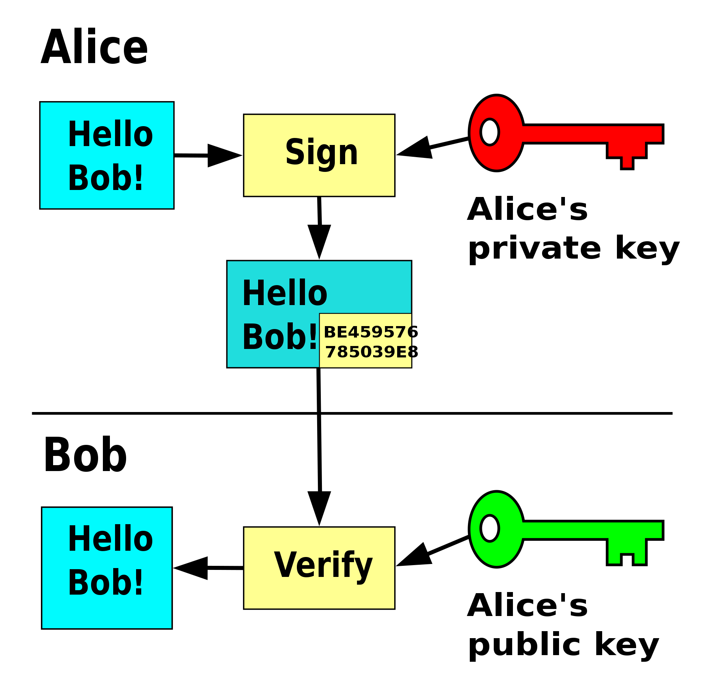
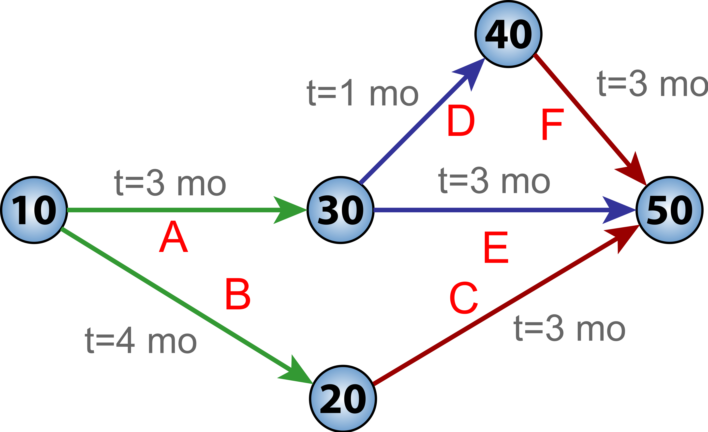
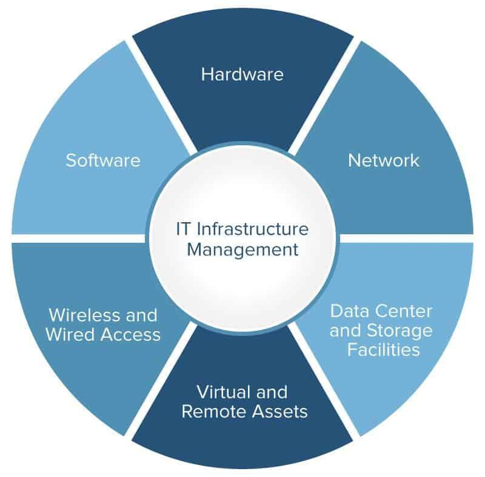

# State exam

## Software engineering

> Software engineering. SW development process. Unified Process (UP) methodology. Agile SW development. Testing phases and types of tests. Software metrics, code refactoring. Estimating efforts. Maintenance and reusability. Software quality.

### SW development process

Process of dividing software development into smaller sequential or parallel steps to improve design and product management. Most modern processes use **Agile**.

The core disciplines of software development are:

- Business modelling
- Requirements
- Analysis & Design
- Implementation
- Test
- Deployment

### Unified Process (UP) methodology

An **iterative** and **incremental** software development process framework. The best known implementation is Rational Unified Process, or **RUP**.

UP divides a project into four phases:

- Inception - smallest phase, focuses on planning and kickoff
- Elaboration - establish risk factors and sketch software design
- Construction - write code and tests, iterate
- Transition - deployment to target users

Each phase puts different emphasis on individual disciplines of software development.

### Agile SW development

In the context of software development, “agile” refers to being able to respond to change. The focus is on rapid prototyping, quick delivery and responsiveness to change of requirements.

Core principles:

- _Individuals and interactions_ over processes and tools
- _Working software_ over comprehensive documentation
- _Customer collaboration_ over contract negotiation
- _Responding to change_ over following a plan

Examples are Scrum, Kanban and Extreme programming.

### Testing phases and types of tests

**Verification** phase, white box testing:

- **Unit tests** - isolated testing of individual components
- **Integration tests** - testing interaction between components

**Validation** phase, black box testing:

- **System tests** - end-to-end testing of the system
- **Acceptance tests** - customer-aided assessment of functionality

### Software metrics, code refactoring

A software metric is a measure of software characteristics that are **quantifiable** or **countable**. The goal of measuring software characteristics is to identify the product quality and establish possible areas of improvement.

Example metrics:

- _Agile metrics_ measure productivity and velocity
- _Security metrics_ relate to exposed vulnerabilities
- _Size metrics_ like LOC, errors per kLOC

Code refactoring serves to improve a lagging metric. For example, slow team velocity can be solved by refactoring the codebase’s CI.

### Estimating efforts

Effort estimation is used to estimate the man-hours or money needed to perform a certain task, like develop a feature or refactor a piece of the codebase.

There are three approach types:

- _Expert estimation_ - competent people estimate efforts
- _Formal estimation_ - a mechanical process is used to calculate efforts
- _Combined estimation_ - a combination of expert judgment and mechanical process is used

### Maintenance and reusability

Maintenance is the modification of an established product in order to fix bugs, improve performance or otherwise increase the product quality.

Categories of software maintenance:

- _Corrective_ - bug fixing mainly
- _Adaptive_ - making the product usable in more environments
- _Perfective_ - improving performance or maintainability
- _Preventive_ - detecting faults before they hit production

Reusability is one of the largest contributors to maintainability of software systems. Building well-tested, quality, documented building blocks can _vastly_ improve development speed and overall code quality.

### Software quality

There are two types of software quality:

- _Functional quality_ reflects how accurate the system corresponds with the design and specification
- _Structural quality_ reflects how well is the software written, tested and documented

Software quality is highly measurable is many areas, like:

- Code-based analysis
- Reliability
- Efficiency
- Security
- Maintainability
- Size

## Information security

> Information security. Audit, security management, risk management, countermeasures. Safety evaluation, evaluation criteria and processes. Standards in IT security and cryptography, legislation related to cryptology. Digital signature - construction, legislation, public key management, certification authorities and public key infrastructure. User authentication in computer systems - secret information, tokens, biometrics. Identification systems and identity management.

### Audit, security management, risk management, countermeasures

Auditing system security refers to verifying the state of the system and organisation’s security. Types of audits can be categorised as:

- _Technical_ - encryption, secret key storage, backup systems
- _Physical_ - hardware reliability, storage security
- _Administrative_ - processes, authorisation, access control

Security management involves identifying and protecting an organisation’s assets. There’s an official standard developed in Netherlands called _Universal Security Management Systems Standard 2017_.

Types of security risks, _internal_ and _external_:

- _Strategic_ - competition, demand, R&D
- _Operational_ - contracts, suppliers, systems and processes (HR, Payroll)
- _Financial_ - FX, credit, liquidity, cash flow
- _Hazard_ - natural disasters, cyber attacks, employees and equipment
- _Compliance_ - legal, processes, regulations

Risk management involves choosing the best strategy to deal with a particular risk:

- _Avoidance_ - avoid potentially risky activities
- _Reduction_ - reducing the potential loss magnitude and likelihood
- _Sharing_ - insurance, outsourcing
- _Retention_ - wielding responsibility and accepting a potential risk

### Safety evaluation, evaluation criteria and processes

Safety is evaluated based on various criteria, such as:

- General security, encryption, access control, authentication and authorisation
- Ease of hardware and software implementation
- Encryption performance
- Flexibility in keying

The evaluation can be a part of automated tests, regular manual assessment or a specialised vulnerability hunting program.

### Standards in IT security and cryptography, legislation related to cryptology

IT security standards are techniques outlined in published materials that attempt to protect the cyber environment of a user or organisation.

The **NIST Cybersecurity Framework** is the most popular documented standard, though it requires significant investment. It was created by the _National Institute of Standards and Technology_.

Issues regarding cryptography law are categorised as:

- _Export control_ - controlling exporting of cryptographic tools
- _Import control_ - controlling importing of cryptographic tools
- _Patent issues_ - use of patented cryptographic tools
- _Search and seizure_ - decryption on demand by law enforcement

### Digital signature - construction, legislation, public key management, certification authorities and public key infrastructure

Digital signatures are a cryptographic proof that the sent message was indeed constructed by the author who signed the message. They employ **asymmetric cryptography** and have legal power in many countries.

1. _Signer_ has a private key, uses it to digest the message and append the signature
2. _Signee_ takes _signer_’s public key and signature, decrypts the signature using the public key and verifies the _signer_’s identity

Digital signatures are used for:

- Authentication
- Integrity
- Non-repudiation

A _Key Management System_ (KMS) is a system for distributing cryptographic keys to devices and applications. One of the most widespread standard is _Key Management Interoperability Protocol_, or **KMIP** for short.

_Certification authority_ is a trusted entity that issues digital certificates. A digital certification certifies the ownership of a public key by the named subject of the certificate.

_Public key infrastructure_ is a type of key management system that uses hierarchical digital certificates to provide authentication, and public keys to provide encryption. Commonly used to encrypt WWW as SSL/TLS.

### User authentication in computer systems - secret information, tokens, biometrics

Users most commonly authenticate themselves using some unique identifier, such as an email or username, and a chosen password.

More advanced authentication flows can include stuff like _biometrics_, _secret tokens_ and _multi-factor authentication systems_.

Users commonly are not re-authenticated with every action. Instead, the device they’re using to access a secret resource is given a _token_ they send with every request, which contains encrypted information about the user’s identity, verifying it is indeed them.

### Identification systems and identity management

_Identity management_ (IdM), or more commonly known as _Identity and access management_, or **IAM** for short, is a framework of policies and technologies that provides user authentication and authorisation.

Commonly used identity management system is Single sign-on.

## Statistics

> Statistics. Descriptive statistics (position and variability characteristics, order statistics, association statistics, related charts). Discrete and continuous random variables (NV). Random choose. Parametric Probability Models (Distribution) NV. Central limit theorem. Credibility principle, point and interval estimates. Statistical inference - hypothesis testing, significance level, reliability coefficient. Testing hypotheses on one sample, two samples, more than two samples (including single-sample, two-sample and paired t-tests, ANOVA and post-hoc tests), good fit tests. Linear regression model.

### Descriptive statistics

> position and variability characteristics, order statistics, association statistics, related charts

Descriptive statistics aim to _summarise a sample_. Some measurements include _central tendency_:

- **Mean** - average value in a sample
- **Median** - value that divides upper and lower half
- **Mode** - value which appears the most often
- **Quantiles** - value that divides certain chunk of data, 1/2 quantile is median

Measurements of _variability_ or _dispersion_ include:

- **Standard deviation** - dispersion of data, square root of variance
- **Variance** - the expectation of a squared deviation from the population mean
- **Minimum and maximum values**
- **Kurtosis** - describes tailness in a probability distribution
- **Skewness** - describes asymmetry in a probability distribution

**Probability distribution** is a mathematical function that gives the probabilities of occurrence of a different possible outcomes of an experiment.

**Probability density** function shows the probability that a value lies in a given interval of values. It is computed as an _area under the curve_ of the probability density function.

**Order statistics** deals with describing data as they appear when ordered:

- 1st order random variable is the **minimum**
- Last order random variable is the **maximum**

**Association statistics** describe relationship between two or more random variables. In this case, descriptive statistics include:

- _Contingency tables_ that display a matrix of frequency distributions
- _Scatter plots_ that graphically represent data points
- _Correlation_ quantitative measures
- _Conditional distribution_ description

### Discrete and continuous random variables

- _Discrete random variables_ have clear space between data points
- _Continuous random variables_ fall under a constant sequence

### Random choice

A _simple random sample_, or SRS for short, is a subset of individuals where each choice is done randomly with the same probability.

### Parametric Probability Models (Distribution) NV

A _parametric model_ is a family of probability distributions with finite number of parameters.

Examples:

- _Poisson family_ - discrete probability distribution expressing a given number of events happening in a fixed time interval, with constant mean rate and independently of the time of the last event
- _Normal family_ - probability distribution that models phenomena with a default behaviour and cumulative deviations from that behaviour
- _Weibull transition model_ - continuous probability distribution
- _Binomial model_ - discrete probability distribution modelling the number of successes of _n_ experiments with a binary outcome

### Central limit theorem

**CLT** establishes that, in many cases, when _independent random variables_ are summed up, their properly normalised sum tends toward a _normal distribution_.

### Credibility principle, point and interval estimates

**Credibility theory** is a form of statistical inference used to forecast an uncertain future event. It combines multiple estimates into a _summary estimate_ that takes into account the accuracy of individual estimates.

**Bias** is the difference between an _estimated value_ and the _true value_ of a chosen population parameter.

**Point estimation** involves the use of sample data to calculate a “best guess” of a certain population parameter, e.g. mean. Properties:

- _Biasness_ - the estimator is biased in a way to produce the smallest _mean square error_
- _Consistency_ - the estimator stays close to the value as population increases, indicating the estimated point was accurate
- _Efficiency_ - the estimator has little variability in its outcomes
- _Sufficiency_ - no other conclusions can be drawn from the population than from the estimator’s output

**Interval estimation** involves the use of sample data to estimate an _interval of plausible values_ of a parameter of interest. Examples:

- _Confidence intervals_ - range of estimates for an unknown parameter
- _Credible intervals_ - interval within which an unobserved parameter value falls with a certain probability

### Statistical inference - hypothesis testing, significance level, reliability coefficient

**Statistical inference** employs data analysis to infer properties of an underlying distribution of probability. Properties of a population are inferred for example by using ._hypothesis testing_.

**Hypothesis testing** verifies that the data at hand sufficiently supports the given hypothesis. Process:

- Choose a _null_ and _alternate_ hypothesis
- Consider statistical assumptions and decide which test is appropriate, state the relevant _test statistic_ `T`, compute `t_obs`
- Compute the _p-value_, which is the probability that the observed statistical difference was random, meaning the lower the p-value, the higher the evidence that the null hypothesis should be rejected
- Reject the null hypothesis in case the p-value is low enough, common thresholds are 0.01 or 0.05

**Significance level** for a hypothesis test is a value for which the p-value less than or equal to is considered statistically significant.

**Reliability coefficient** is a number that indicates the accuracy of a test. It is calculated by giving the test to the same subject more than once and determining whether there’s a correlation which is the strength of the relationship and similarity between the two scores.

### Testing hypotheses on one sample, two samples, more than two samples, good fit tests

> including single-sample, two-sample and paired t-tests, ANOVA and post-hoc tests

**T-test** is any statistical hypothesis test that is performed on a normally distributed data set with a known scaling parameter — following a “Student’s t-distribution”.

The **one-sample** t-test determines whether an unknown population’s mean is different from a specific value. The sample should be picked randomly from a normally distributed population.

A **two-sample** t-test, a.k.a. independent samples t-test, is a test which compares two groups’ means. This test is used for analysing the results of an A/B test.

A **paired** t-test checks if the mean difference between pairs of measurements is zero or not. This is used for example during before-and-after measurements.

**Good-fit**, a.k.a. K-S test, is a test that compares the shape of distributions with similar means and variances.

**ANOVA** (analysis of variance) is a generalised t-test that analyses difference among two and more means of distributions.

**Post-hoc** tests are performed after a statistically significant result is found by a different test. Their goal is to find the root cause of the difference.

### Linear regression model

**Linear regression** is a linear model — it assumes linear relationship between input variables and a single output variable. The output can be calculated as a linear combination of inputs.

Linear regression tries to create a model which best estimates a given dataset. This is most commonly done using an algorithm that minimises the least-square error, which is the distance between an actual data point and the estimated line:

## Database

> Database. Management of relational database systems, terminology, principles. Data representation and storage. Query evaluation and optimisation, statistics, table splitting. Indexing and hashing, indexing for multiple attributes. Transaction processing, recovery. Security, access rights, SQL attacks.

### Management of relational database systems, terminology, principles

_RDBMS_ stands for _relationship database management system_ — a program for reading databases, updating and deleting rows, as well as managing users, their access and the database schema.

Most relational databases use _SQL_, which stands for _structured query language_. It is a language used for domain description and querying.

### Data representation and storage

Data in a relational database is organised into _tables_, which have _columns_ of a specific type. One _row_ in a table is a concrete piece of data.

A **primary key** is a column, or a set of columns, that uniquely represent a row. Oftentimes, this is simply an auto incrementing integer, or a UUID.

Relationships are represented using **foreign keys** — columns in a table which reference other table’s _primary key_.

### Query evaluation and optimisation, statistics, table splitting

Once a query is submitted, the RDBMS evaluates the query and prepares an optimal procedure to execute it. The _query plan_ can be inspected using `EXPLAIN`.

The output of `EXAMINE` is then used to check if the executor uses the correct indexes, planning new indexes and what the overall cost of the operation is.

It is good practice to split tables (unless optimising performance) to split tables until they’re in their _normal form_. There’s multiple levels of normal forms:

- _1NF_ - each column has only one value
- _2NF_ - every non-prime attribute is dependent on the whole candidate key
- _3NF_ - every non-prime attribute is dependent on every key
- _4NF_ - every multivalued dependency in a table is a superkey
- …more are too extra to even mention

### Indexing and hashing, indexing for multiple attributes

**Indexing** creates a tree structure that is used for retrieval by an _indexed column_ in `log(n)` time. This is especially useful for selecting a range of elements and sorting.

Indexes can also be applied to any expression performed on the table, as well as multiple attributes.

**Hashing** uses a hashing function to directly access a data row by its key in `O(n)` time. This is useful for selecting an element by its key, or in _hash joins_.

### Transaction processing, recovery

Operations are performed in **transactions** so that the database is never in a state of partial operation application. Database transactions make databases ACID:

- Atomic
- Consistent
- Isolated
- Durable

Techniques for recovering a database include:

- _Full database backup_ - dumps all data
- _Differential backup_ - stores data that changed from the last backup
- _Transaction log_ - stores details about all transactions, making the database repayable

### Security, access rights, SQL attacks

Databases need a high level of security to protect both the data _retention_ and _privacy_. In addition to hardware protection, security is achieved by careful **access rights** management.

Good practice is to only give:

- _Admin_ access to actual admins
- _Read-write_ access to applications
- _Read_ access to core application developers

SQL attacks, commonly known as **SQL injection**, are a very common security breach attempt done by intentionally submitting input that could break the query, such as username `’; DROP TABLE users;`.

Mitigating such attack is very simply done by using _prepared statements_ — API for creating SQL queries that sanitises user input and prevents such attacks.

## Basics of management

> Basics of management. Basics of management analysis (PESTE, SWOT, 6C). Interest groups and their interests. Management by competence, theory of vitality. Strategic orientation of the company and planning. Evaluation of people and motivation. Strategic management, synergy and its role in management and leadership. Risk management and its principles.

### Basics of management analysis (PESTE, SWOT, 6C)

**PEST** analysis, which stands for _political, economic, social and technological_, is an environment scanning method in strategic management:

- _Political_ - stuff that government is up to
- _Economic_ - how’s the global market doing
- _Social_ - population gender, age in the certain area
- _Technological_ - technological change, automation

**SWOT** analysis is a management strategy for projects. Its goal is to provide statistical overview of the project and pinpoint opportunities for improvement. The letters stand for:

- _Strengths_ - controllable factors that show great potential
- _Weaknesses_ - controllable aspects that would use improvement
- _Opportunities_ - uncontrollable factors that could enhance the project
- _Threats_ - uncontrollable areas that could damage the project’s progress

**6C** of credit refers to the characteristics of credit. The six Cs are considered when businesses apply for a loan:

- _Character_ - subjective assessment of the business owner
- _Capacity_ - the firm’s position to pay the loan
- _Capital_ - the owner must have his own capital in the company
- _Conditions_ - current economical environment and the intent of the credit
- _Collateral_ - possibility of the bank using other means, like stocks and equipment sales, to repay unpaid debt
- _Cash-flow_ - the company’s profits over its operation cost

### Interest groups and their interests

An **interest group** is a group of people within a larger organisation with a shared interest of advocating a specific area of knowledge, learning, technology or methodology.

These groups spread their ideas and knowledge into the wider community by creating learning materials and organising meet-ups and various social events.

### Management by competence, theory of vitality

_Competence-based strategic management_ is a way of thinking how organisations can gain high performance for a significant period of time. Five modes of competence:

- Ability to imagine alternative strategic logics
- Ability to imagine alternative management processes
- Flexibility to identify and employ resources
- Resource flexibility to be used in alternative operations
- Operating flexibility with available resources

_Theory of vitality_ says basically that the company can serve the customer only as well as is the wellbeing of their employees. It is thus paramount to:

- Pay people enough
- Make sure they’re healthy and energised

### Strategic orientation of the company and planning

_Strategic orientation_ refers to thinking in terms of increasing the competitiveness of the company. Concrete steps are evaluated based on internal and external research.

_Strategic planning_ is the process of gathering insights that are later used as inputs for strategic thinking. This includes:

- Company strengths and weaknesses
- Personal values of the key implementers
- Industry opportunities and threats
- Broader societal expectations

### Evaluation of people and motivation

_Performance evaluation_ is a systematic process of evidence-based documentation and evaluation of a staff member’s performance. Their potential benefits include setting clear goals for the employee, giving them vision, building trust.

Employee motivation is the internal drive to put forth the necessary effort towards work-related activities. This includes:

- _Rewards_ in the form of salary, bonuses, hardware, vacations
- _Job design_ like task rotation, variety, responsibility, simplification
- _QOL programs_ related to health
- _Collective activities_ like team buildings

### Strategic management, synergy and its role in management and leadership

_Strategic management_ involves the formulation and implementation of the major goals and initiatives taken by the organisation’s manages towards stakeholders based on available resources and assessing internal and external environments.

_Leadership_ is about getting employees on board towards a shared company vision. _Management_ is about controlling the process of getting towards an established goal. Their synergy lies in leadership creating the vision, and management handling the execution.

### Risk management and its principles

_Risk management_ deals with identifying, evaluating and prioritising risks (the effect of uncertainty of objectives), followed by coordinated application of resources towards avoiding them, or minimising their impact.

_Opportunity management_ is a part of risk management as well, since missed opportunities impose _opportunity cost_ on the organisation.

Process:

- Identify threats
- Assess vulnerability of critical assets to said threads
- Determine the risk chance and magnitude
- Identify ways to reduce the risk
- Prioritise risk reduction measures

Risk management involves choosing the best strategy to deal with a particular risk:

- _Avoidance_ - avoid potentially risky activities
- _Reduction_ - reducing the potential loss magnitude and likelihood
- _Sharing_ - insurance, outsourcing
- _Retention_ - wielding responsibility and accepting a potential risk

## Project management

> Project management. International project management standards. Project, program, portfolio (PPP). Life cycle of IT projects. Process groups in the project. Project planning. Calculation of project costs. Gantt charts and project milestones. Network Analysis, Critical Path Method (CPM), Program Evaluation and Review Technique (PERT). Project quality assurance, testing, review, measurement and standards.

### International project management standards

- _ISO 21500_ is a cascade-approach standard for project management, not much used for software, since iterative approaches are preferred there
- _PMBOK_ is the most widespread publication about project management
- _PRINCE2_ is a recognised structured project management standard with a great scale

### Project, program, portfolio (PPP)

- **Project** - a temporary endeavour which aims to create a unique product, service or result
- **Program** - relationship between projects and subsidiary programs that share a common goal
- **Portfolio** - portfolio of individual projects and programs of the given business

### Process groups in the project

According to _PMBOK_, there are 5 process groups of a project:

- **Initialising** - writing the project charter, getting stakeholder approval
- **Planning** - plan to achieve the established goal within budget and deadline, work breakdown structure, Gantt chart, risk management
- **Executing** - development, stakeholder engagement, QA
- **Monitoring** - keeping an eye on finalising the project, corrective work
- **Closing** - getting a sign-off approval from stakeholders

### Project planning

First, a document outlying the proposed project, its goals and outcome is created, called the **project charter/plan**.

Then a sequence of diagrams is created to illustrate the work to be done and the duration:

1. **Work breakdown structure** - breaking down the necessary tasks and their duration into their atomic elements and creating a hierarchy
2. **Project network diagram** - a graph which displays in which order shall the project’s tasks be completed
3. **Gantt chart** - shows the project’s schedule, estimated milestones and sequence of tasks

The _task duration_ can be calculated as the weighted average of optimistic, realistic and pessimistic estimates, or via other methods, like _critical-chain_.

From estimating tasks and their duration, necessary resources can be estimated, and cost can be calculated. Cost-to-duration ratio can be adjusted in this phase.

After calculating costs and establishing tasks and their durations, and after drafting an appropriate risk management, a **baseline schedule** is created, which is used as a reference for assessing the project progress.

### Calculation of project costs

Once the volume of work needed is estimated, calculating the project costs is trivial:

1. Calculate salary needed for each team member based on WBS man-days
2. Calculate all tools necessary to execute the project
3. Add in any potential outsourcing costs

_Risk factors_ are then calculated in as well, with considered probability and magnitude. These are then factored into the cost estimation.

### Gantt charts and project milestones

As mentioned _Gantt charts_ show the list of tasks defined in WBS and display various data and the task relationships:

- Task durations and dependencies
- Parallel / sequential relationships between tasks
- Project milestones and current progress

### Network Analysis, Critical Path Method (CPM), Program Evaluation and Review Technique (PERT)

**Network diagram** displays chronology of tasks defined in WBS and specifies which ones are to be done in parallel, which sequentially, and outline task dependencies.

**Critical Path Method** is an algorithm used in conjunction with PERT that calculates the longest stretch of dependent project activities, measuring the chain’s duration from start to finish.

**Program Evaluation and Review Technique** is a statistical tool used in project management to describe tasks necessary to complete a given project.

The result is a _directed graph_ where:

- _Arrows_ represent tasks
- _Nodes_ represent project milestones

A task’s duration is a weighted average calculated as `O*4R*P / 6` where:

- _Optimistic estimate_ - `O`
- _Realistic estimate_ - `R`
- _Pessimistic estimate_ - `P`

_CPM_ is then used for identifying the most efficient project scheduling, and it is then commonly drafted as a _Gantt chart_.

### Project quality assurance, testing, review, measurement and standards

_Quality assurance_ is a process which ensures the robustness and correctness of the developed project. A widespread data-driven approach to QA is [define, measure, analyze, improve, control](https://en.wikipedia.org/wiki/DMAIC), or _DMAIC_ for short.

QA is achieved using:

- Unit, integration and end-to-end testing
- Manual testing
- Specification verification
- Code reviews

Many aspects of quality can be measured. In the context of software development, this includes:

- Team velocity
- Issue frequency and resolution frequency
- Performance

## IT services management

> IT services management. Principle, processes, outsourcing. Information Technology Infrastructure Library (ITIL), basic concepts, service infrastructure management.

### Principle, processes, outsourcing

_IT services management_, or ITSM, deals with managing IT services offered to customers on a high-level. ITSM adopts processes that are created to improve customer experience and help fulfil their needs.

**Outsourcing** is the practice of using a managed service, instead of investing resources into creating or managing such service in-house. Processes are designed to work with the service as-is, rarely requesting modifications from the service provider.

### Information Technology Infrastructure Library (ITIL)

**ITIL** is a set of detailed practices that aim to align IT services with the needs of business. ITIL contains a set of processes and practices that are organisation and technology agnostic, but can be applied to any organisation and technology to deliver value and maintaining competency.

The newest version is v4, which presents four dimensions of service management:

1. organisations and people
2. value streams and processes
3. information and technology
4. partners and suppliers

ITILv4 also contains a handful of best practices in these three categories:

1. _general management practices_ - projects and portfolios, enterprise risk, workforce and talent
2. _service management practices_ - business analysis, service design, monitoring
3. _technical management practices_ - software development, deployment, infrastructure

### Service infrastructure management

Service infrastructure management deals with the use of essential operational elements to effectively work with technology, information and data. This includes:

- _Hardware_ - server management and provision, data storage
- _Networking_ - bandwidth, security, latency
- _Security_ - access control, attack prevention
- _Processes_ - efficiency, transparency
- _Integration_ - effective use of 3rd party services

## Communication

> Communication. Communication theory. Moderation techniques. Learning levels, knowledge, skills, attitudes. Active listening. Human-centered communication. Groups and teams, group process, team building, separate teams. Conflict management and transformation.

### Communication theory

_Communication theory_ is a proposed description of communication phenomena, relationships between them and a storyline describing these relationships.

Core elements are:

- _Source_ - the information source
- _Sender_ - the transmitter of communication
- _Channel_ - communication medium
- _Receiver_ - the decoder of communication
- _Destination_ - the target audience of the information
- _Message_ - the communicated information
- _Feedback_and \_entropic elements_

### Moderation techniques

- **Supervisor moderation** involves dedicated administrators of content checking user-submitted content and enforcing community rules.
- **Distributed moderation** relies on users moderating themselves, with the premise that malicious users are outnumbered by ones who truly care about the content quality.

### Learning levels, knowledge, skills, attitudes

_Learning levels / styles_ refer to a range of theories that aim to account for differences in individuals and their ability to learn topics via different approaches.

There are many models of learning, many of which deal with:

- _Learning approaches_ that mix-and-match theory, practice, reflection
- _Learning modalities_ such as visual, audio, tactile or written learning
- _Learning levels_ such as intuition, application, understanding, explanation

_Knowledge_ is facts, information and skills acquired through learning and practicing. _Skills_ are various activities one gets better at through practice. _Attitude_ is the way one approaches a problem.

### Active listening

_Active listening_ is the practice of conversation participation that emphasises understanding and offering an appropriate feedback to the message being sent.

General guidelines:

- Keep attention on the message, including non-verbal signals
- Refrain from crafting response while listening
- Refrain from _any_ judgment
- Paraphrase, clarify and summarise the response

### Human-centered communication

_Human-centered communication_ is a set of practices that guides the communication flow primarily from the human perspective. This practice is most commonly seen between companies and their customers.

The goal is to make the end-user feel like they’re communicating with a human they can trust and that they’re comfortable with the communication.

### Groups and teams, group process, team building, separate teams

_Teams_ are groups of people with synergistic skillsets, working towards a shared goal, sharing knowledge and responsibility.

_Group process_ is a process which revolves around a group of people, rather than an individual. Organisations move great lengths in order to get groups of people be productive together to achieve shared goals.

_Team buildings_ are an important part of organisation management, since they create trust and comfort among team members, leading to increased productivity.

_Separate teams_ communicate together usually via dedicated team leaders. Usually, teams work in silos on their goals, and cross-team communication allows creating contracts and collaboration between individual teams.

### Conflict management and transformation

Managing conflicts revolves around:

- maintaining peace among involved parties
- blamelessly find out the root cause
- draft a prevention plan for the future, if possible

In general, prevention via unblocking communication is the best. Teams and team members should all have a sense of a shared vision, together with built trust and comfort.

Conflict transformation analyses conflicts that arise, ensure sustainable peace and address the underlying root conditions which caused the outburst of hostility.

## System verification and assurance

> System verification and assurance. Principles, advantages, disadvantages and limitations of methods for testing systems without knowledge of code and other techniques for formal verification of computer systems such as symbolic execution, model validation for LTL and CTL formulas, bounded model validation, transition system abstraction and CEGAR method.

### Principles, advantages, disadvantages and limitations of methods for testing systems

Aspects of testing:

- _mission_ - why we test
- _strategy_ - how do we test
- _oracle_ - what do we test, specification and/or documentation
- _incompleteness_ - what aspects cannot be realistically tested
- _measure_ - how much are we actually testing, test coverage

There are many reasons to test, such as bug hunting, collecting data, conforming to specification, etc.

Two general strategies to testing:

- _black box_ - implementation details hidden, contract testing, I/O
- _white box_ - implementation details visible and taken into account, also testing coverage, edge cases

### Symbolic execution

Used for testing all possible input combinations that produce different execution trees in a program.

Instead of using specific values, a _symbolic value_ is created for each input variable. These have _restrictions_ stored next to them based on the conditions encountered in the program’s branching.

- Nodes are never merged back to the tree
- Tree may grow exponentially and to infinity

_SAT_ solving is used for deciding which parts of the execution tree are reachable. Unreachable ones are discarded.

### Model validation for LTL and CTL formulas

**LTL**, which stands for Linear Temporal Logic, formulas describe the state of a _single run_ of a system. Rules describe state transitions within a single run.

LTL grammar includes checking for existence of a state _F_ finally, _G_ globally.

**CTL**, which stands for Computation Tree Logic, formulas describe the state of _all possible runs_ of a system. Rules describe states in one or all possible runs.

CTL grammar allows checking for _A_ all branches, or _E_ exists branch.

**CTL \*** is a superset of both LTL and CTL.

### Bounded model validation

Model validation with a finite length. The goal is making model validation scalable and performant, avoiding state space explosion problems.

The path length is normally extended up to the _path diameter_ — the longest loop-free path. This ensures complete coverage of the system.

Bounded models are verified using SAT functions:

- if the SAT solver cannot find a substitution in the model, the property holds
- if the SAT solver finds a substitution, the substitution includes a counterexample for the property

### Transition system abstraction and CEGAR method

Abstraction is the process of building an abstracted version of a model in order to simplify its verification.

Over-approximation:

- Correct ATS -> Correct CTS
- Error in ATS -> Maybe error in CTS

Under-approximation:

- Error in CTS -> Error in ATS
- Correct CTS -> Maybe correct ATS

**CEGAR** stands for Counter Example Guided Abstraction Refinement and is a process of refining a model until it satisfies a given property, or until a non-spurious error is found.

## Distributed systems

> Distributed systems. Basic concepts, principles. The difference between centric and distributed system architecture. Virtualisation, horizontal / vertical scalability. Data sharding, high-availability. Examples of existing technologies and their use. Web services, implementation example (SOAP / WSDL / REST).

### Basic concepts, principles

Distributed systems are systems located on different machines connected via a network. Systems form a _peer-to-peer_ network, are both horizontally and vertically scalable.

### The difference between centric and distributed system architecture

Centralised systems:

- Client-server
- Only vertically scalable
- Single point of failure
- Cheaper, easier to maintain

Distributed systems:

- Peer-to-peer
- Horizontal and vertical scaling
- High fault tolerance
- Complex orchestration and maintenance, expensive

### Virtualisation, horizontal / vertical scalability

**Virtualisation** is the process of creating a virtual environment for the consumer, hiding implementation details of the underlying system.

In the context of distributed systems, virtualisation means _sharing resources_ between multiple clients. This is heavily utilised in cloud computing, where the actual hardware structure of the organisation is completely abstracted by the cloud provider, and resources are managed and provisioned on demand by a software system.

_Vertical scalability_ means increasing raw power of the underlying server.

_Horizontal scalability_ means adding more servers to the system.

### Data sharding, high-availability

**Data sharding**, also called _horizontal partitioning_, is the process of splitting a database table into multiple tables across physical databases. There are two popular strategies:

- _Range-based_ - splits data based on some comparable value
- _Hash-based_ - splits data based on the the primary key

**High availability** (HA) is achieved when systems are able to operate for long periods of time without failure. This is mainly achieving by efficient replication, logging and monitoring of database systems, as well as load balancing, incremental releasing for services.

### Examples of existing technologies and their use

- _Telecommunications_ - internet, telephone networks, routing solutions
- _Network applications_ - world wide web and peer-to-peer network
- _Real-time process control_ - aircraft control systems
  _Parallel communication_ - scientific computing, distributed rendering

### Web services, implementation example (SOAP / WSDL / REST)

**Web services** are devices communicating with each other via the web, like a server running on a computer, responding to requests with web documents (HTML, JSON…).

Web servers have a defined API that describes how to communicate with said service in the intended manner. APIs can be defined by various protocols, such as:

- _SOAP_ (Simple Object Access Protocol) - XML messaging protocol, document is called an envelope, has headers and a body
- _WSDL_ (Web Services Description Language) - XML-based interface description for web services
- _REST_ (Representational state transfer) - resource-based messaging protocol that uses the HTTP protocol’s standards to access resources and link to further related resources
- _GraphQL_ - query language for APIs and a runtime for fulfilling those queries with existing data

## Computer networks

> Computer networks. Concepts, principles, architecture. OSI model, Internet protocols, static and dynamic routing. Basic computer network services, network security. Security in system sessions (SSL, SSH, IPSec, WEP, WPA, Kerberos) and Internet environment. Security in SOA, security of web services.

### Concepts, principles, architecture

A computer network is a set of computers connected to each other, sharing resources by network nodes. Computers use communication protocols over digital interconnections to communicate.

Devices are identified by:

- _MAC address_ - the physical address of the device
- _IP address_ - logical address of the device
- _Port_ - the communication channel

Data is transmitted via packets, which are small parts of data that go from computer-to-computer, are encoded by a protocol, and routed based on their MAC and IP addresses, and the port number.

Network can be assembled into different topologies like a _bus_, _star_, _mesh_ or _ring_, depending on the nature of the network.

### OSI model, Internet protocols, static and dynamic routing

The **Open Systems Interconnection** model, or OSI, is a model describing universal standard of communication across computer networks. It contains 7 layers, bottom-up:

1. _Physical_ - transporting individual bit streams
2. _Data link_ - transporting data frames between two nodes connected by a physical layer
3. _Network_ - structuring a multi-node network that communicate via packets
4. _Transport_ - reliable transmission of data segments between points on the network
5. _Session_ - managing continuous sessions between two nodes on the network
6. _Presentation_ - translation of raw data from the network to the application, like encoding and encryption
7. _Application_ - high-level APIs like resource and file sharing

The **internet protocol** is a _network layer_ communication protocol designed for delivering packets between different IP addresses. It was originally created as a connectionless datagram service, complemented later by the connection-oriented **Transmission Control Protocol**, or TCP, forming the TCP/IP suite. A connectionless alternative to TCP is **User Datagram Protocol**, or UDP.

- TCP brings guarantees of order and completeness to packet transmission
- UDP is faster, but without guarantees, and harder to make secure

_Static routes_ are configured in advance of any network communication. This offers better security and performance, however, is only usable on small networks.

_Dynamic routing_ requires routers to exchange information with each other to learn paths across the network. Algorithms keep the network up-to-date.

### Basic computer network services, network security

Services examples:

- E-mail
- File sharing
- World Wide Web
- Cloud computing
- Databases
- VoIP
- Online gaming

To properly secure a network, the security has to be employed on various layers:

- _Encryption_ of transmitted data
- _Firewall_ to restrict traffic origins and ports
- Control mechanisms to block malicious traffic
- _Authentication_ for proof of identity
- _Authorisation_ for access control

### Security in system sessions (SSL, SSH, IPSec, WEP, WPA, Kerberos) and Internet environment

System sessions security:

- _TLS_ - Transport Layer Security, a protocol that prevents eavesdropping and tampering of network traffic, used by websites, VoIP, emails, works on the _transport layer_
- _SSH_ - Secure Shell, allows operating networks services securely over an unsecured network, used commonly for remote login and command line, works on the _application layer_
- _IPSec_ - Internet Protocol Security, provides secure communication of devices on the _network layer_
- _WEP_ - Wired Equivalent Privacy, an attempt to make wireless networks as secure as wired ones
- _WPA_- Wi-Fi Protected Access, successor of WEP, is a family of security programs for securing Wi-Fi networks
- _Kerberos_ - a computer network authentication protocol to allow nodes to prove identity to one another over an unsecured network

Security over the internet environment:

- Treat every single internet interaction as public, every shared information is public and permanent
- Internet connects everyone, there are very evil people online, like murderers and rapists and torturers — keep that in mind
- Use a password manager with a very long and strong master password, keep the master password on paper
- Keep e-mail address private, ideally use an e-mail proxy service
- Use a two-factor authentication wherever available

### Security in SOA, security of web services

Security in service-oriented architecture (SOA) deals with ensuring individual services communicate with each other in a secure manner.

One of the most commonly used SOA protocols is _Security Assertion Markup Language 2.0_, or SAML 2.0. The protocol uses security tokens that contain assertions about the end-user in communication between the identity provider and service providers. This enables single-sign on (SSO), a popular web-based multi-service authentication flow.

Web services security includes:

- _Authentication_ - proof of identity
- _Authorisation_ - access control
- _Confidentiality_ - secrecy of the transported message
- _Integrity_ - confidence in the transported message

Web services use a combination of approaches, including encryption of the communication, secret tokens as proofs of identity and authentication flows for user identification.

## Object methods of system design

> Object methods of system design. Design patterns. Software architectures. Component interfaces, signatures and service constraints, OCL. Component systems and models, quality aspects of services (QoS). Object methods of software development, RUP.

### Design patterns

Design patterns are resoluble solutions for commonly encountered patterns in software engineering. Common patterns:

- _Singleton_ - (anti)pattern for single global instances of a class
- _Factory_ - a function that creates instances of classes instead of directly instantiating them
- _Builder_ - convenient API for creating instances with multiple parameters
- _Iterator_ - an API for iterating over a type without knowing its underlying implementation
- _Observer_ - one-to-many dependency between objects, where multiple other objects are notified when the underlying observed object changes
- _Adapter_ - convert one interface to another

### Software architectures

_Software architecture_ refers to the fundamental structure of a software system that describes various aspects of its structure. Software architecture is being developed on various levels, from high-level service overview, down to detailed description of individual components. Object-oriented design patterns are essentially a form of low-level object architecture.

Examples of architecture models:

- Client-server
- Component-based
- Data-centric
- Layered
- Microservices
- Monolithic
- Peer-to-peer
- Pipes and filters
- Plug-ins
- Representational state transfer (REST)

Agile development often collides with very detailed and rigorous architecture plans, favours flexibility and architectural adaptation instead.

### Component interfaces, signatures and service constraints, OCL

An **interface** is a boundary description of behaviour a component should provide. If a component implements an interface, that means that the component performs every task described by the interface.

A **signature** is the specific input and output type of an interface boundary. This can be as low-level as the specific type of a function, or as high-level as the API of a service.

In the context of system design, a **constraint** is a specific condition the input value to a service must obey, such as a specific enumeration of string values, integer value range, or a specific combination of inputs. Constraints can also be imposed on a specific state of a component.

**Object Constraint Language**, or OCL, is a declarative language for specifying constraints of objects, their methods and internal state. It’s a part of the Unified Modelling Language (UML) specification.

### Component systems and models, quality aspects of services (QoS)

Component-based development, or _CBD_ (not oil), focuses on developing isolated and reusable components with clear responsibilities that contribute towards a software system. The pattern is analogous to the _Microservices_ pattern of the _service-oriented architecture_ (SOA) paradigm.

**Component model** is a definition of properties that components must satisfy. It includes methods and mechanisms for composition of components. Examples of component models are _Enterprise JavaBeans_ (EJB), _Common Object Model_ (COM), _.NET_ model, _Common Object Request Broker Architecture_ (CORBA).

**Quality of service**, or QoS, is a measurable description of the overall performance of a service. Depending on the nature of the service, measurements can include:

- Availability
- Packet loss
- Latency
- Error rate
- Throughput

### Object methods of software development, RUP

Many currently available domain modelling systems, such as UML, are inherently oriented towards the object-oriented paradigm, as seen by the heavy usage of class diagrams, OCL involving state invariants and objects calling each other’s methods.

**Rational Unified Process**, or RUP, is an iterative and incremental software development process framework, an implementation of Unified Process (UP). It is an example of an object-oriented domain modelling paradigm.

RUP is based on building blocks, describing what is to be produced and the necessary steps to achieve that goal. The main content elements are:

- _Roles_ (who)
- _Products_ (what)
- _Tasks_ (how)

RUP defines a set of best practices to be followed for optimal project delivery:

- Develop iteratively
- Manage requirements
- Use components
- Model visually
- Verify quality
- Control changes

Each project has four main stages:

- _Inception_ - business modelling and gathering requirements
- _Elaboration_ - analysis of requirements and clarification of details
- _Construction_ - actual design, implementation and writing tests
- _Transition_ - deploying to production

Each iteration of a project development consists of 6 main and 3 supporting disciplines. The main disciplines are:

1. Business modelling
2. Requirements
3. Analysis and design
4. Implementation
5. Test
6. Deployment

The supporting disciplines are:

- Configuration and change management
- Project management
- Environment

## Business applications

> Business applications. Basic concepts of software architectures. Layered architecture of modern information systems, model-view-controller. Service Oriented Architecture (SOA). Deployment. Basic concepts of cloud computing. Object-relational mapping (ORM) in business applications. Design patterns in large enterprise systems (Data Transfer Object (DTO), Data Access Object (DAO), Facade, Dependency Injection (DI)).

### Basic concepts of software architectures

_Software architecture_ refers to the fundamental structure of a software system that describes various aspects of its structure. Software architecture is being developed on various levels, from high-level service overview, down to detailed description of individual components. Object-oriented design patterns are essentially a form of low-level object architecture.

Examples of architecture models:

- Client-server
- Component-based
- Data-centric
- Layered
- Microservices
- Monolithic
- Peer-to-peer
- Pipes and filters
- Plug-ins
- Representational state transfer (REST)

Agile development often collides with very detailed and rigorous architecture plans, favours flexibility and architectural adaptation instead.

### Layered architecture of modern information systems, model-view-controller

**Layered architecture** is one of the most common styles. The main idea is that components with similar functionality (accessing database, performing business logic, serialising data…) are organised into horizontal layers.

The premise of this architecture is that it provides separation of concerns and is testable on various levels. However, it also results in a tightly-coupled and rigid software with major scalability issues. That is why, in recent times, the movement has been shifting towards flatter architectures, such as _microservices_.

**Model-view-controller**, or MVC, is a form of layered architecture that was popular for creating user interfaces.

- _Model_ tackles persistence and business logic, provides data to the view
- _View_ is responsible for displaying user interface
- _Controller_ handles user inputs and side effects, manipulating the model

### Service Oriented Architecture (SOA)

**Service-oriented architecture**, or SOA, is an architectural pattern in which services are provided to other components via network communication, like _gRPC_ or _REST_ protocols.

A _service_ is discrete unit of functionality that can be remotely accessed. Its properties:

- Represents a logically repeatable business activity with a specified outcome
- Self-contained
- Black-box for its consumers
- May be composed of other services

The most common SOA architecture style is _microservices_. The SOA manifesto, created in 2009, states the following:

1. _Business value_ over technology stack
2. _Strategic goals_ over project-specific benefits
3. _Intrinsic interoperability_ over custom integration
4. _Shared services_ over specific implementations
5. _Flexibility_ over optimization
6. _Evolutionary refinement_ over perfect implementation

### Deployment. Basic concepts of cloud computing

Deployment of applications can be done:

- _On-premises_ - company managed servers
- _In the cloud_ - provisioned virtual computing environment

Nowadays, unless control over server hardware or extreme security measures are necessary, cloud computing is the norm.

**Cloud computing** refers to a hardware-as-a-service solution for providing storage and computing power to users. This abstracts the need to manage hardware and low level infrastructure.

### Object-relational mapping (ORM) in business applications

**Object-relational mapping**, or ORM, is a paradigm for abstracting relational database manipulations to an object-like paradigm within a language. ORM libraries provide tools for database schema management as well as CRUD operations and simpler compound queries.

Applications often use ORMs mainly to simplify mapping database types to the language’s types, simplify common CRUD operations, make database-agnostic schemas, as well as simplify spinning up development environments for testing.

### Design patterns in large enterprise systems (Data Transfer Object (DTO)

**Data transfer object**, or DTO, is an object whose role is transferring data between processes. This can for example mean transferring data from a business application to the service’s API interface, like REST.

### Data Access Object (DAO)

**Data access object**, or DAO, is an object whose role is managing its persistence lifecycle. The object is hooked to a persistence mechanism, like a database, and provides tools for querying, creating, updating or deleting objects of this type, as well as holds relationship information to other DAOs.

### Facade, Dependency Injection (DI)

**Facade** is an object-oriented design pattern that hides implementation details of business logic behind convenient interface. This pattern is often used in layered systems to hook external APIs to lower layers of software responsible for persistence.

**Dependency injection**, or DI, is a software design pattern where an object that depends on a service, receives the service, instead of constructing it itself. This abstracts constructing services from using services, and is often necessary to facilitate mocking in testing, or replacing services with other services as necessary.

## Applied information systems

> Applied information systems. Information systems and their role in management, their goals, problems of analysis and design. IS in production, state administration, health care. Geographic IS.

### Information systems and their role in management, their goals, problems of analysis and design

**Information system**, or IS, is a technical and social system designed for storing, managing and distributing information. Information systems are important for all levels of the company structure.

There are various kinds of information systems, depending on their role and target audience within the company:

- Transaction processing systems
- Management information systems
- Decision support systems
- Learning management systems
- Database management systems

Components of an information system:

- _Hardware_ - computers, all kinds of IO devices
- _Software_ - programs necessary to operate the hardware
- _Data_ - the facts used to produce useful information
- _Procedures_ - policies of operating the information system
- _People_ - operators and maintainers of the system
- _Internet_ (optional) - combination of data and people

**Management information system** is an IS used for decision making, and for coordination, control, analysis and visualisation of information within an organisation. CTOs and CIOs are mostly responsible for their incorporation.

Examples of types of management information systems:

- Decision support system
- Executive information system
- Marketing information system
- Human resources information system
- Enterprise resource planning

_Analysis and design_ of an information system involves mapping requirements of the organisation and addressing them in an efficient manner. The process is:

1. Interview the people of the organisation, from executives to the workers, to gather use-cases
2. Draft requirements based on collected information, review with stakeholders
3. Create a technical design that reflects the requirements, all the way from data persistence to user interface
4. Proceed with implementation of tests and functionality

### IS in production, state administration, health care

Production information system is used to aid organisations in production. The components are:

- Long-term planning - planning the conversion system, specifying sequence of operations
- Annual production plan - planning the transformation process, optimising inventory, labour
- Inventory control - managing the number of units produced
- Production scheduling - what to make, when to make it, how much…
- Dispatching - making sure produced goods reach their destination

State administration information system revolves around managing various layers of official administrative tasks. This includes processing citizen requests, official citizen data, criminal records. State infrastructure can also be included, like managing road work, land records, infrastructure.

Health care information system keeps track of patient’s medical history, gathers data from sensors such as EKG. The system can also manage workers, equipment, hospital planning.

### Geographic IS

Geographic information system, or GIS, is a type of database containing geographic data. The system is responsible for gathering, processing and visualising geographic data. Example geographic data:

- Landscape heatmaps
- Cartographic modeling
- Roads vectored from raster images
- Sea maps with ports, depth, landmarks
- 3D city visualisation

#school
